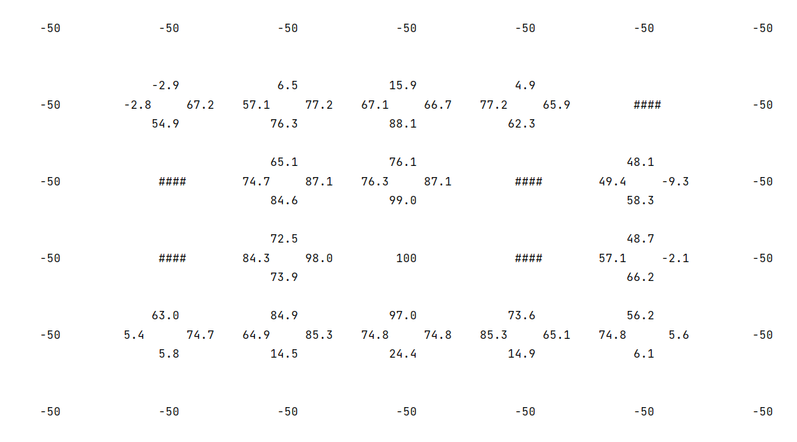

# Robot Routing with Q-Learning
This repository contains an implementation of Q-Learning algorithm to navigate the robot towards the goal from every single state of the environment.

## About Q-Learning
Q-learning is a model-free reinforcement learning algorithm to learn the value of an action in a particular state. It does not require a model of the environment (hence "model-free"), and it can handle problems with stochastic transitions and rewards without requiring adaptations. For any finite Markov decision process, Q-learning finds an optimal policy in the sense of maximizing the expected value of the total reward over any and all successive steps, starting from the current state [[Wiki](https://en.wikipedia.org/wiki/Q-learning)].

## Problem Instructions
We aim to implement one of the Reinforcement Learning algorithms: the _Q-Learning algorithm_. We extend the **windy** maze with probabilistic outcome after an action and a few terminal states with rewards +100 and −50 respectively. The maze map is shown as follows:

  

We assume that the agent doesn’t know either the reward function or the transition model. 
The agent aims to run many trials in order to obtain the Q-value for each (state, action) pair and the optimal action at each state.
We assume that the wind comes from the north and the cost of one step for the agent is defined as follows: 
1 for moving southward; 2 for moving westward or eastward; 3 for moving northward. The cost will be the negation of the reward.
If the moving direction is an obstacle, it will be bounced back to the original position. If the agent falls into any terminal state, it can’t move out.

### Specifications
- The algorithm should generate 50,000 trials starting from a random open square.
- Each trial will end at the goal state and abort the train if the number of steps goes more than 100.
- The agent will use the $\epsilon-Greedy$ algorithm to choose an action at each state along each trajectory, where $\epsilon = 0.1$.
- Along each trajectory, the agent will use Q-Learning to update the Q-values according to these equations:

  

## Implementation
The implementation in [main.py](main.py) consists of four parts:
- **Definitions:** declaration variables and constants with regard to the instructions. This part of the implementation represents the maze as a numpy-array with each cell in it with value 1 as an obstacle and 0 as an open square. In addition, the reward of each cell is represented as another numpy-array. The Q-table and N-table both are Hash-Tables, implemented using a predefined Dictionary in python.

- **Helper functions:** implementation of functions that provide needed algorithms.
  - Function `is_inside`: it checks whether the given tuple contains the position of a cell inside the maze environment or not.

  - Function `is_terminal`: it checks whether the given tuple contains the position of a terminal cell or not. A cell with a defined reward (-50 or +100) is terminal.

  - Function `is_block`: it checks whether the given tuple contains the position of an obstacle or not.

  - Function `init_tables`: it initializes the Q and N dictionaries for every non-block state (cell) in the environment by 0 for all actions and adds them to a list ‘available_states’ for further use.

  - Function `get_next_state`: it takes a state and an action, and returns the next state.

  - Function `get_transition_reward`: it takes the information of transition and returns the resulting reward according to the cost of the direction of that action and the reward of the next state.

  - Function `get_available_actions`: it returns the available actions that do not cause it to move out of the environment.

  - Function `q_learning`: it is the implementation of Q-learning algorithm.

- **Driver code:** implementation of a series of instructions (also called “main”) to use the algorithm for the given maze and then print out the final result.

## Output
The access frequency at each state-action $N_{s,a}$:

  

 

The Q-value function at each state-action $Q(s, a)$;

  

 

The optimal action at each state-action:

  

